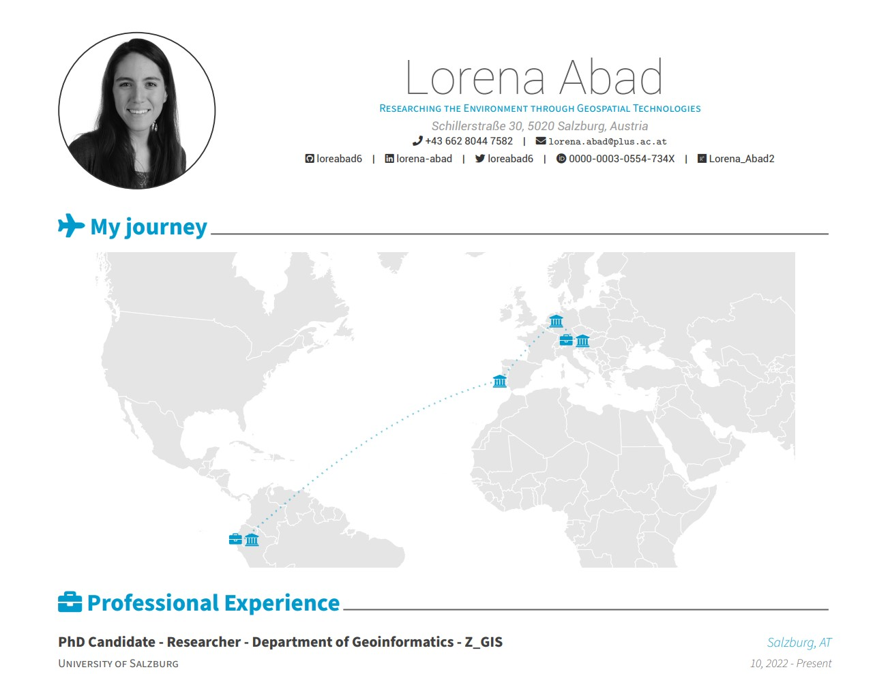

# Lorena Abad - Curriculum Vitae

My CV created with the [vitae](https://github.com/mitchelloharawild/vitae) package in R. 

To reproduce, please copy the [awesome-cv.cls](awesome-cv.cls) file to the directory with your `.Rmd` file.

